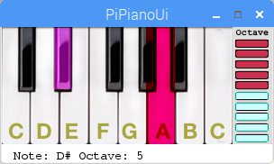
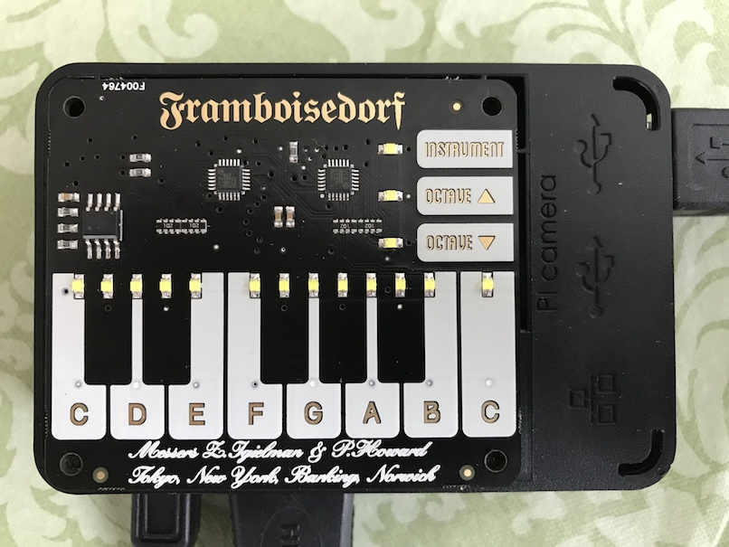

# PiPianoUi
Graphical UI and hooks for using Pimoroni's Raspberry Pi Piano Hat

The [Piano-HAT](https://shop.pimoroni.com/products/piano-hat) from Pimoroni,
is a great capacitive keyboard with LED's for the Raspberry Pi.
However the [example code](https://github.com/pimoroni/Piano-HAT/tree/master/examples)
is a bit slim, and it can be difficult to know the current instrument or octive when using it.
This project is based on that example code, but is a new implementation.

This is an expanded UI and API for interacting with the Piano-HAT, pygame, python-midi, and more.
You can code up your own instrument implementations and add them to the queue of available instruments.

You can use the computer keyboard in addition to the Piano-HAT. This allows for testing and development on other platforms or without requiring the Piano-HAT hardware.

Documentation includes a complete parts list, assembly instructions, software install steps, and problems encountered.

Piano-HAT and this project fully support Python3. However the version of [python-midi](https://github.com/vishnubob/python-midi/issues/35) as of May 2018 does not.
Thus the software installation instructions are currently for Python2.

