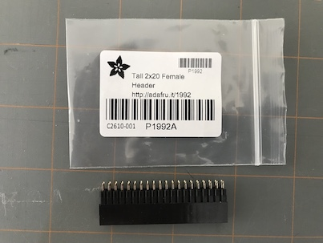
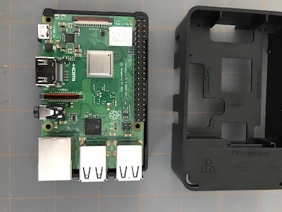
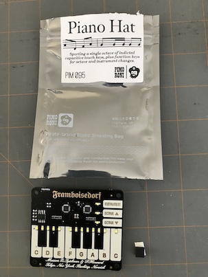
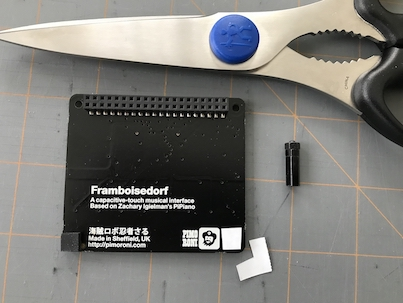
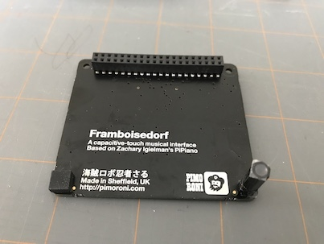
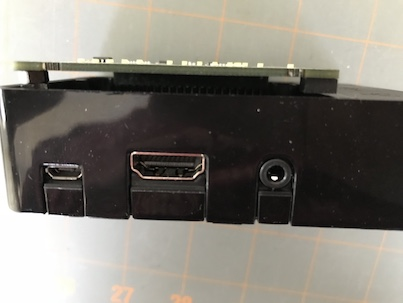

Hardware Assembly
=================

The parts have an assembly order to be properly installed. The GPIO header must
be installed before the case, before the heatsinks. The proper order is detailed
below. Once the assembly is done, follow the normal canakit instructions for
setting up the operating system.

.. contents::

Parts
-----------

.. note::

    Initially this build was intended to use a different case, but I ordered the
    wrong part, and ended up using the one which comes with the canakit.
    This has it's problems as you will see below. I would recommend using one of
    the following cases instead: https://www.adafruit.com/product/2083 https://www.adafruit.com/product/2292

    
.. image:: img/canakit.jpg

* Canakit: https://www.canakit.com/raspberry-pi-3-model-b-plus-starter-kit.html

* USB Midi Sequencer (optional): https://www.amazon.com/HDE-Synthesizer-Microphone-Instrument-Converter/dp/B00D3QFHN8
* some double sided sticy tape
* Piano-Hat: https://www.adafruit.com/product/2695
* GPIO Header: https://www.adafruit.com/product/1992
* Brass standoffs: https://www.adafruit.com/product/2336

GPIO Header
-----------

Install the GPIO Header before putting the Raspberry Pi in the supplied canakit case.

.. image:: img/pi.jpg

canakit Raspberry Pi box contents

.. image:: img/riser2.jpg

Make sure the GPIO Header is fully seated.

Case
-----------

Now install the board in the case.

.. note:: Make sure the SD card is NOT installed!

.. image:: img/case1.jpg

.. image:: img/case3.jpg

Heat Sinks
-----------

Now you can install the heat sinks.

.. image:: img/heat1.jpg

.. image:: img/heat2.jpg

.. image:: img/heat3.jpg

Piano-Hat
-----------

Finally we can put the piano hat on. It was designed with a slightly different
case in mind, but I do prefer the end look the canakit case provides. To this end
we are using some double sided stiky tape to secure the board! You can likely do
better than this and should. But this is what I did, and it worked well.

.. image:: img/hat03.jpg

.. image:: img/hat04.jpg

.. image:: img/hat05.jpg

.. image:: img/hat03.jpg

.. image:: img/hat09.jpg

