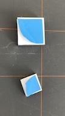
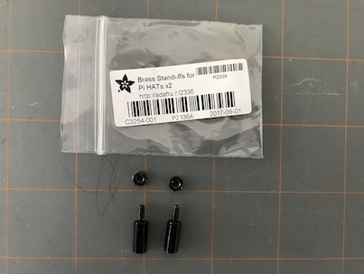

.. raw:: pdf

   PageBreak
   
Hardware Assembly
=================

.. image:: img/assembled2.jpg

The parts have an assembly order to be properly installed. The GPIO header must
be installed before the case, before the heatsinks. The proper order is detailed
below. Once the assembly is done, follow the normal canakit instructions for
setting up the operating system.
   
.. contents::

.. raw:: pdf

   PageBreak
   
Parts
-----------

.. note::

    Initially this build was intended to use a different case, but I ordered the
    wrong part, and ended up using the one which comes with the canakit.
    This has it's problems as you will see below. I would recommend using one of
    the following cases instead: https://www.adafruit.com/product/2083 https://www.adafruit.com/product/2292

    
.. image:: img/canakit.jpg

* Canakit: https://www.canakit.com/raspberry-pi-3-model-b-plus-starter-kit.html

.. image:: img/parts.jpg

* USB Midi Sequencer (optional): https://www.amazon.com/HDE-Synthesizer-Microphone-Instrument-Converter/dp/B00D3QFHN8
* some double sided sticy tape
* Piano-Hat: https://www.adafruit.com/product/2695
* GPIO Header: https://www.adafruit.com/product/1992
* Brass standoffs: https://www.adafruit.com/product/2336

.. raw:: pdf

   PageBreak
   
GPIO Header
-----------

Install the GPIO Header before putting the Raspberry Pi in the supplied canakit case.

canakit Raspberry Pi box contents

.. image:: img/riser1.jpg

GPIO Header

.. image:: img/riser3.jpg

Make sure the GPIO Header is fully seated. Do not yet install the heat sinks.

.. raw:: pdf

   PageBreak
   
Case
-----------

Now install the board in the case.

.. note:: Make sure the SD card is NOT installed!

.. image:: img/case2.jpg

Seat the card in the case bottom, with the PCB under the top tabs.

The case snaps into place over the bottom, sliding the GPIO header through the
opening for it.

.. raw:: pdf

   PageBreak
   
Heat Sinks
-----------

Now you can install the heat sinks.

Remove the backing from the adheasive and firmly place the heatsinks.

The direction of the heat sink fins do not matter.

.. raw:: pdf

   PageBreak
   
Piano-Hat
-----------

Finally we can put the piano hat on. It was designed with a slightly different
case in mind, but I do prefer the end look the canakit case provides. To this end
we are using some double sided stiky tape to secure the board! You can likely do
better than this and should. But this is what I did, and it worked well.

.. image:: img/hat02.jpg

.. raw:: pdf

   PageBreak

The Piano-HAT is packaged with a foam spacer. Attach this to the back as shown.

.. image:: img/hat06.jpg

Fasten two of the bras standoff nuts on a single brass standoff.

.. image:: img/hat07.jpg

.. image:: img/hat08.jpg

I am not proud of this hack, but we will be using double sided sticky tape
(provided) to "secure" the standoff to give the Piano-HAT proper support in
the case. This is not intended as a perminent solution.

.. image:: img/hat09.jpg

.. image:: img/hat10.jpg

Push the brass standoff into the hole covered by the double sided tape, and place
and additional square of tape on the bottom of the standoff. This will NOT feel
secure or sturdy.

.. image:: img/hat11.jpg

.. image:: img/hat12.jpg

Carefully but firmly place the HAT into the case and onto the GPIO header pins.
This should now feel secure.

