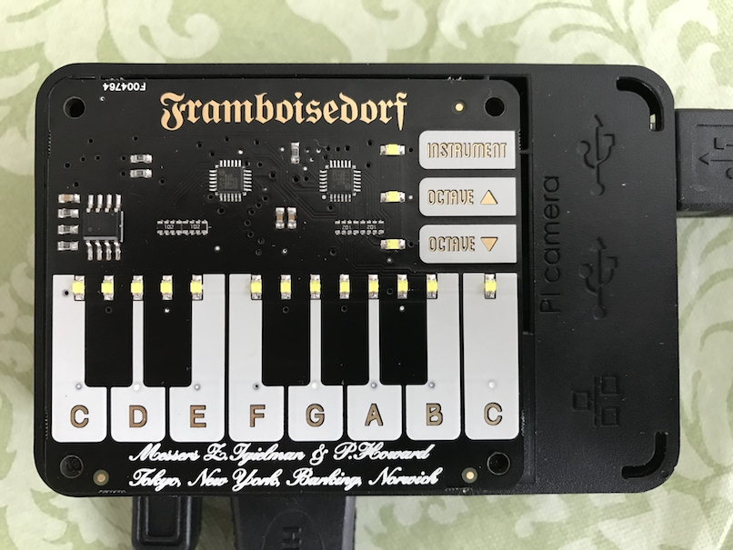

.. PiPianoUi documentation master file, created by
   sphinx-quickstart on Sun Apr 29 19:51:50 2018.
   You can adapt this file completely to your liking, but it should at least
   contain the root `toctree` directive.

PiPianoUi 
=====================================

.. image:: img/PiPianoUi.png
   :align: center

A graphical interface supporting an extensible instrument framework for
`Pimoroni's Piano-HAT <https://shop.pimoroni.com/products/piano-hat>`_ and
the Raspberry Pi.

The `Piano-HAT <https://shop.pimoroni.com/products/piano-hat>`_ from Pimoroni,
is a great capacitive keyboard with LED's for the Raspberry Pi.
However the `example code <https://github.com/pimoroni/Piano-HAT/tree/master/examples>`_
is a bit slim, and it can be difficult to know the current instrument or octive when using it.
This project is based on that example code, but is a new implementation.

This is an expanded UI and API for interacting with the Piano-HAT, pygame, python-midi, and more.
You can code up your own instrument implementations and add them to the queue of available instruments.
See :ref:`pipianoui` for the API documentation.

You can use the computer keyboard in addition to the Piano-HAT. This allows for testing and development on other platforms or without requiring the Piano-HAT hardware.

Documentation includes a complete parts list, assembly instructions, software install steps, and problems encountered.

Contents:

.. toctree::
   :maxdepth: 2
   :glob:
   
   *

* :ref:`genindex`

Important links:

* Main product page - https://shop.pimoroni.com/products/piano-hat
* Getting started - https://learn.pimoroni.com/tutorial/piano-hat/getting-started-with-piano-hat
* Github Repository - https://github.com/pimoroni/Piano-HAT
* Guides and tutorials - https://learn.pimoroni.com/piano-hat
* pianohat Function reference - http://docs.pimoroni.com/pianohat/
* GPIO Pinout - https://pinout.xyz/pinout/piano_hat
* Get help - http://forums.pimoroni.com/c/support
* USB MIDI Sequencer - https://www.amazon.com/HDE-Synthesizer-Microphone-Instrument-Converter/dp/B00D3QFHN8
