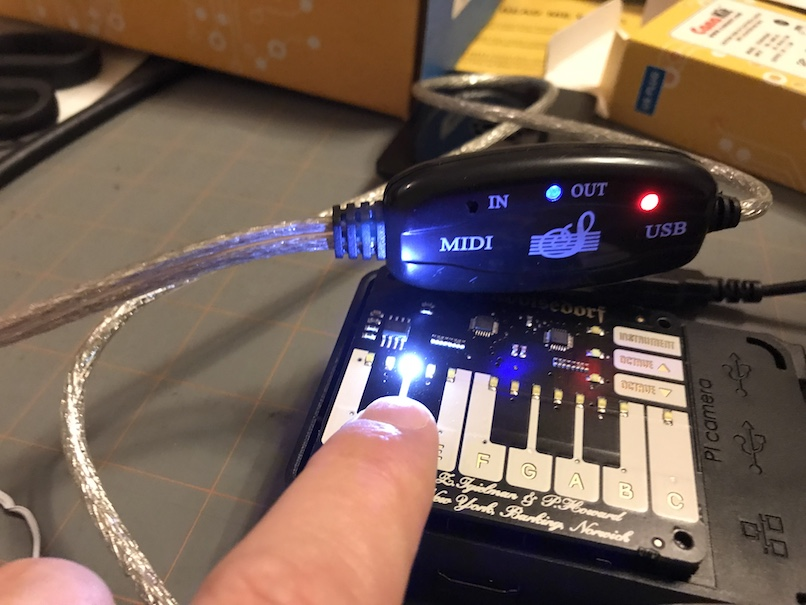

Installing Software
==============================

This project relies on having the Piano-Hat, python-midi, numpy and other projects installed.
For most operating systems virtualenv is the best way to go. For the Raspberry Pi, the python-midi
package must be compiled locally. This requires more work.

These instructions detail installing all the required software and then running PiPianoUi as the last step.

Important links:

* Main product page - https://shop.pimoroni.com/products/piano-hat
* Getting started - https://learn.pimoroni.com/tutorial/piano-hat/getting-started-with-piano-hat
* Github Repository - https://github.com/pimoroni/Piano-HAT
* Guides and tutorials - https://learn.pimoroni.com/piano-hat
* pianohat Function reference - http://docs.pimoroni.com/pianohat/
* GPIO Pinout - https://pinout.xyz/pinout/piano_hat
* Get help - http://forums.pimoroni.com/c/support
* USB MIDI Sequencer - https://www.amazon.com/HDE-Synthesizer-Microphone-Instrument-Converter/dp/B00D3QFHN8

.. note:: 

    The 8bit-synth.py example is out of date. 
    The fixed version is here: https://github.com/pimoroni/Piano-HAT/issues/15

The easiest way to install piano hat:

.. code-block:: console

    pi@raspberrypi:~ $ curl https://get.pimoroni.com/pianohat | bash
    

Running the examples
--------------------

.. code-block:: console

    pi@raspberrypi:~ $ cd ~/Pimoroni/pianohat/examples
    pi@raspberrypi:~/Pimoroni/pianohat/examples $ ls
    8bit-synth.py  learn-to-play.py  midi-piano.py  simple-piano.py
    buttons.py     leds.py           README.md      sounds

simple-piano.py will use the wav (or .ogg) files in the sounds directory. 
Each sub-directory is a different insterment. This is a great place to start.
This comes with a full piano and a simple drum set. 

8bit-synth.py is a simple synthesizer, but the currently released version has a bug.
See the following page for bug status and working code: https://github.com/pimoroni/Piano-HAT/issues/15

The midi-piano.py muse be run as root (sudo python midi-piano.py) to get access to the hardware sound cards.
The python-midi package is required, as well as a working midi sequencer. 
The kit comes with a USB based sequencer. See instructions below

All examples can be quit by using Ctrl-C

.. raw:: pdf

   PageBreak
   
Configuring for Midi Output
---------------------------

.. code-block:: console

    pi@raspberrypi:~ $ sudo apt-get install python-dev libasound2-dev swig
    pi@raspberrypi:~ $ git clone https://github.com/vishnubob/python-midi
    pi@raspberrypi:~ $ cd python-midi/
    pi@raspberrypi:~/python-midi $ sudo ./setup.py install
    pi@raspberrypi:~/python-midi $ cd ~/Pimoroni/pianohat/examples

   
Configuring for a USB Midi Sequencer
.....................................

This kit includes a USB Midi Sequencer found here:
https://www.amazon.com/HDE-Synthesizer-Microphone-Instrument-Converter/dp/B00D3QFHN8

This will allow for both Midi input and output. 
These instrcutions are for setting up the PianoHat to work with the sequencer output.

Plug in the USB midi Sequencer, and find the hardware name:

.. code-block:: console

    pi@raspberrypi:~/Pimoroni/pianohat/examples $ cat /proc/asound/cards 
     0 [ALSA           ]: bcm2835_alsa - bcm2835 ALSA
                          bcm2835 ALSA
     1 [CH345          ]: USB-Audio - CH345
                          QinHeng CH345 at usb-3f980000.usb-1.1.2, full speed

    pi@raspberrypi:~/Pimoroni/pianohat/examples $ sudo aconnect -i
    client 0: 'System' [type=kernel]
        0 'Timer           '
        1 'Announce        '
    client 14: 'Midi Through' [type=kernel]
        0 'Midi Through Port-0'
    client 20: 'CH345' [type=kernel,card=1]
        0 'CH345 MIDI 1    '

    pi@raspberrypi:~/Pimoroni/pianohat/examples $ sudo aconnect -o
    client 14: 'Midi Through' [type=kernel]
        0 'Midi Through Port-0'
    client 20: 'CH345' [type=kernel,card=1]
        0 'CH345 MIDI 1   

We see the name is 'CH345'. It may be different for you. 
We need to update the midi-piano.py example to support this device:

.. code-block:: console

    pi@raspberrypi:~/Pimoroni/pianohat/examples $ nano midi-piano.py 

Change the supported list to include the USB bridge::

    #supported = ['yoshimi','SunVox']
    supported = ['yoshimi','SunVox', 'CH345']

.. raw:: pdf

   PageBreak
   
Run the midi-puano.py example

.. code-block:: console

    pi@raspberrypi:~/Pimoroni/pianohat/examples $ sudo python midi-piano.py 

Yuo will know it is working when pressing keys on the PianoHAT will cause the ``OUT`` blue LED on the 
USB sequencer to flicker. Each key-press and unpress is a single event. The LED should not remain on.

.. raw:: pdf

   PageBreak
   
midi-piano.py run on boot
-------------------------

This is VERY optional and only required for immediate headless operation with the Testla coil. 
In this mode, the USB Midi sequencer must be plugged in before booting to work.

.. code-block:: console

    pi@raspberrypi:~ $ sudo nano /etc/rc.local

Add before the ``exit 0`` at the bottom::

    sudo /home/pi/Pimoroni/pianohat/examples/midi-piano.py > /home/pi/Pimoroni/pianohat/examples/midi-piano.log &
    exit 0

You can stop the process later as follows:

.. code-block:: console

    pi@raspberrypi:~ $ ps -aux | grep python
    root       434  0.2  2.4  62440 23412 ?        Sl   00:36   0:00 python /home/pi/Pimoroni/pianohat/examples/midi-piano.py
    pi         891  0.0  0.0   4372   556 pts/0    S+   00:40   0:00 grep --color=auto python
    pi@raspberrypi:~ $ sudo kill 434

Installing PiPianoUI
--------------------

This ends up being the very last thing you do to have everything working.

.. code-block:: console

    pi@raspberrypi:~ $ git clone https://github.com/dougn/PiPianoUi.git
    pi@raspberrypi:~ $ cd PiPianoUi
    pi@raspberrypi:~/PiPianoUi $ python pipianoui.py